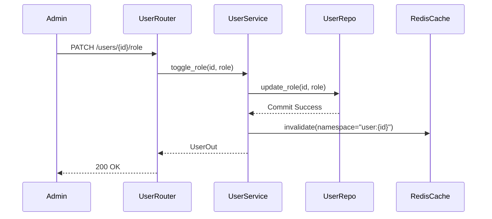

# Technical Architecture — Document Classifier

This document provides a detailed breakdown of the system architecture, folder layout, and data flow invariants.

## 🏗 System Architecture

The Document Classifier is a distributed system consisting of four primary service containers and several infrastructure components:

- **api**: FastAPI service handling HTTP requests, authentication, and permission enforcement.
- **worker**: RQ (Redis Queue) consumer performing synchronous document inference and overlay generation.
- **sftp-ingest**: Python polling worker that validates incoming SFTP uploads and moves them to object storage.
- **frontend**: React SPA (Vite/TypeScript) providing the administrative and reviewer interface.

### Infrastructure Layer
- **PostgreSQL 16**: Primary metadata and audit log persistence.
- **Redis 7**: Shared cache backend and task queue storage (AOF enabled).
- **MinIO**: S3-compatible object storage for source TIFFs and generated overlays.
- **HashiCorp Vault**: Secure storage for JWT signing keys and system credentials.
- **SFTP (atmoz/sftp)**: External vendor drop-zone.

---

## 📂 Folder Layout

```text
project-root/
├── backend/
│   ├── app/
│   │   ├── main.py                    # Entrypoint & Lifespan (Vault → Casbin → Cache)
│   │   ├── api/                       # HTTP Layer (Routers & Dependencies)
│   │   ├── services/                  # Business Logic & Cache Invalidation
│   │   ├── repositories/              # Data Access Layer (SQLAlchemy 2.0)
│   │   ├── domain/                    # Pydantic Domain Contracts
│   │   ├── db/                        # Persistence Schema & Session Management
│   │   ├── infra/                     # Adapters (Vault, MinIO, RQ, SFTP)
│   │   │   ├── worker_blob.py         # [NEW] Synchronous blob adapter for RQ
│   │   │   └── ...
│   │   └── classifier/                # ML Core (Predictor & Startup Checks)
│   ├── worker/                        # RQ Worker entrypoint
│   ├── sftp_ingest/                   # SFTP Polling entrypoint
│   ├── alembic/                       # Schema Migrations
│   ├── scripts/
│   │   ├── demo_pipeline.py           # [NEW] End-to-end integration test script
│   │   └── ...
│   └── tests/                         # Multi-layer test suite
├── frontend/                          # React SPA Workspace
├── docker/                            # Infrastructure configuration
│   ├── sftp/
│   │   └── fix-permissions.sh         # [NEW] SFTP mount permission fix
│   ├── migrate.Dockerfile
│   └── vault-init.sh
├── README.md                          # Project Landing Page
├── ARCH.md                            # Technical Deep-Dive
├── DECISIONS.md                       # Architecture Decision Records
└── RUNBOOK.md                         # Operational Procedures
```

---

## 🛡 Layer Boundaries & Invariants

| Layer | Responsibility | Constraints |
|:---|:---|:---|
| **HTTP** | Request/Response shaping, Auth enforcement. | No SQL; No business logic; No cache invalidation. |
| **Services** | Orchestration, Transactions, Caching. | Source of truth for cache invalidation. |
| **Repositories** | Data persistence and retrieval. | No `HTTPException`; No cache awareness. |
| **Infra** | External system communication. | Implementation-specific (Vault, S3, etc). |
| **Classifier** | Model inference and image processing. | Zero dependencies on DB or API layers. |

---

## 🚦 Endpoint Matrix

| Method | Path | Access | Cached |
|:---|:---|:---|:---|
| `GET` | `/me` | Any Auth | 60s |
| `GET` | `/batches` | Reviewer+ | 30s |
| `PATCH` | `/users/{id}/role` | Admin | Inval: `user:{id}` |
| `PATCH` | `/predictions/{id}/label`| Reviewer | Inval: `batches:*` |

---

## 🔄 Sequence Trace: Role Update Invalidation



> [!NOTE]
> The next `GET /me` request for the updated user will result in a **Cache Miss**, forcing a fresh fetch from the DB and ensuring the new permissions take effect immediately without a logout.