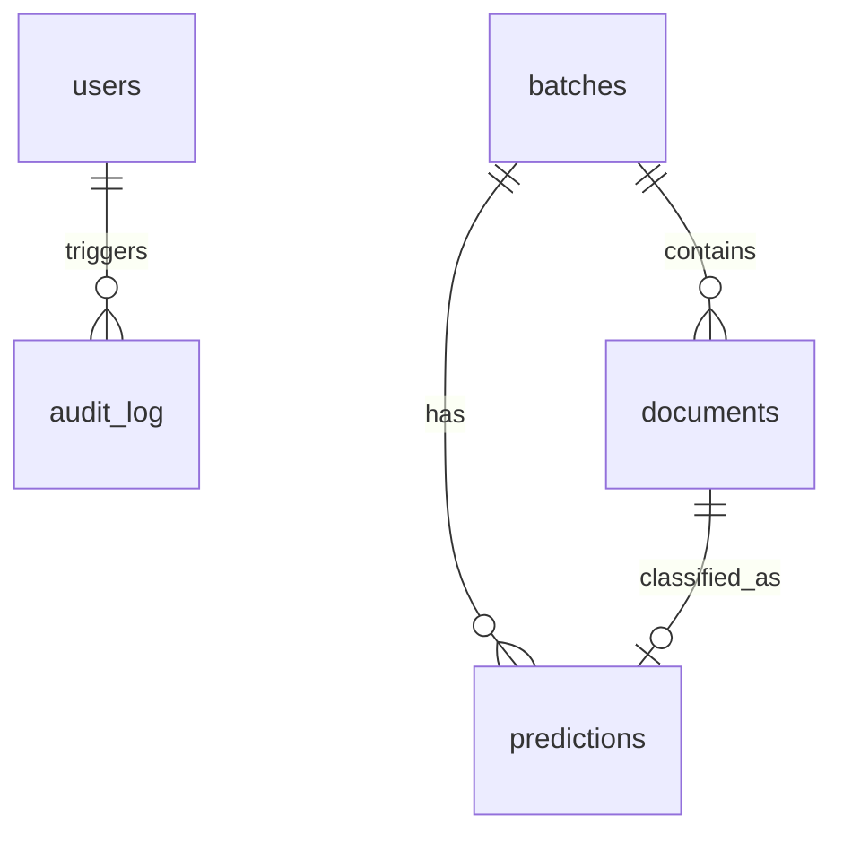

# Database Schema — ERD

## Tables

### `users`
| Column | Type | Constraints |
|---|---|---|
| id | UUID | PK, default `gen_random_uuid()` |
| email | VARCHAR(255) | UNIQUE, NOT NULL |
| hashed_password | VARCHAR(255) | NOT NULL |
| role | VARCHAR(20) | NOT NULL, CHECK IN ('admin', 'reviewer', 'auditor') |
| is_active | BOOLEAN | NOT NULL, default `true` |
| created_at | TIMESTAMPTZ | NOT NULL, default `now()` |

Managed by `fastapi-users[sqlalchemy]`. The `role` column is added via a custom mixin.

### `batches`
| Column | Type | Constraints |
|---|---|---|
| id | UUID | PK, default `gen_random_uuid()` |
| status | VARCHAR(20) | NOT NULL, CHECK IN ('pending', 'processing', 'complete', 'failed') |
| document_count | INTEGER | NOT NULL, default `0` |
| created_at | TIMESTAMPTZ | NOT NULL, default `now()` |

### `documents`
| Column | Type | Constraints |
|---|---|---|
| id | UUID | PK, default `gen_random_uuid()` |
| batch_id | UUID | FK → `batches.id` ON DELETE CASCADE |
| blob_key | VARCHAR(500) | NOT NULL |
| created_at | TIMESTAMPTZ | NOT NULL, default `now()` |

### `predictions`
| Column | Type | Constraints |
|---|---|---|
| id | UUID | PK, default `gen_random_uuid()` |
| document_id | UUID | FK → `documents.id` ON DELETE CASCADE |
| batch_id | UUID | FK → `batches.id` ON DELETE CASCADE |
| label | VARCHAR(50) | NOT NULL, CHECK IN (16 RVL-CDIP labels) |
| top1_confidence | FLOAT | NOT NULL, CHECK `(top1_confidence >= 0 AND top1_confidence <= 1)` |
| top5 | JSONB | NOT NULL |
| overlay_url | VARCHAR(500) | NULL |
| model_version | VARCHAR(50) | NOT NULL |
| created_at | TIMESTAMPTZ | NOT NULL, default `now()` |

**UNIQUE constraint** on `(batch_id, document_id)` — ensures worker idempotency.

### `audit_log`
| Column | Type | Constraints |
|---|---|---|
| id | UUID | PK, default `gen_random_uuid()` |
| actor_id | UUID | FK → `users.id` ON DELETE SET NULL |
| action | VARCHAR(20) | NOT NULL, CHECK IN ('role_change', 'relabel', 'batch_state') |
| target | VARCHAR(255) | NOT NULL |
| metadata | JSONB | NULL |
| timestamp | TIMESTAMPTZ | NOT NULL, default `now()` |

### `casbin_rule`
| Column | Type | Constraints |
|---|---|---|
| id | SERIAL | PK |
| ptype | VARCHAR(12) | NOT NULL |
| v0 | VARCHAR(128) | |
| v1 | VARCHAR(128) | |
| v2 | VARCHAR(128) | |
| v3 | VARCHAR(128) | |
| v4 | VARCHAR(128) | |
| v5 | VARCHAR(128) | |

Schema matches `casbin_sqlalchemy_adapter` expectations.

## Relationships

## Indexes

- `predictions(batch_id, document_id)` — UNIQUE, used for idempotent upsert
- `predictions(batch_id)` — for batch-scoped queries
- `predictions(created_at DESC)` — for "recent" listing
- `audit_log(timestamp DESC)` — for paginated audit queries
- `audit_log(actor_id)` — for user-scoped audit queries